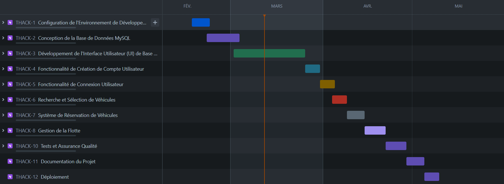

# Cahier des Charges
## Projet de Location de Voitures - Motorized Wide Area

### Introduction et Contexte
Le projet vise à développer une application de location de voitures en JavaFX. Les utilisateurs pourront choisir parmi les 10 plus grandes villes de France pour la prise en charge et la restitution des véhicules.

### Besoins et Exigences
L'application offrira une sélection de véhicules adaptée au nombre de passagers : familiales, sportives, citadines, berlines, SUV et minibus. Les utilisateurs (interne) pourront créer un compte, rechercher des véhicules, effectuer des réservations et gérer leurs informations personnelles des clients.

### Spécifications Fonctionnelles
Description détaillée des fonctionnalités de l'application, y compris l'interface utilisateur pour la recherche de véhicules, la sélection des villes, la réservation et la gestion de compte.

### Spécifications Techniques
L'application sera développée en JavaFX. Les choix techniques supplémentaires pour le backend, la base de données et les intégrations seront définis en fonction des exigences du projet.

### Planification et Méthodologie
Utilisation d'une méthodologie Agile pour le développement de l'application, avec des sprints et des revues régulières pour assurer un progrès constant. La planification détaillée du projet, incluant le diagramme de Gantt, est réalisée à l'aide de l'outil Jira, ce qui permet une organisation efficace des tâches et une meilleure visibilité sur l'avancement du projet. Toutes les versions du code source et les sauvegardes du projet sont gérées sur GitHub, offrant un contrôle de version robuste et facilitant la collaboration entre les membres de l'équipe de développement.

Jira : https://nihoncollection.atlassian.net/jira/software/projects/THACK/boards/4?atlOrigin=eyJpIjoiMmM1ZWJiMmZjNmE0NGUxZmFlOTVjMjI1Mjk0YWFiOGEiLCJwIjoiaiJ9

### Critères de Qualité et de Performance
Des tests seront effectués pour garantir la performance, la réactivité et la fiabilité de l'application sur différents systèmes d'exploitation.

### Diagramme de Cas d'Utilisation

# Cas d'Utilisation

## Gestion des Réservations
- Réserver un véhicule pour un client.
- Modifier ou annuler une réservation existante.
- Consulter l'historique des réservations.

## Gestion de la Flotte
- Ajouter un nouveau véhicule à la flotte.
- Mettre à jour les informations d'un véhicule (maintenance, disponibilité).
- Retirer un véhicule de la flotte.

## Gestion des Clients
- Créer un nouveau profil client.
- Mettre à jour les informations du client.
- Gérer les demandes et les réclamations des clients.

## Administration du Système
- Gérer les comptes utilisateurs et les rôles.
- Configurer les paramètres du système.
- Assurer la sécurité des données et la conformité.

### Diagramme GANTT

### Maquette de l'inteface de connexion

