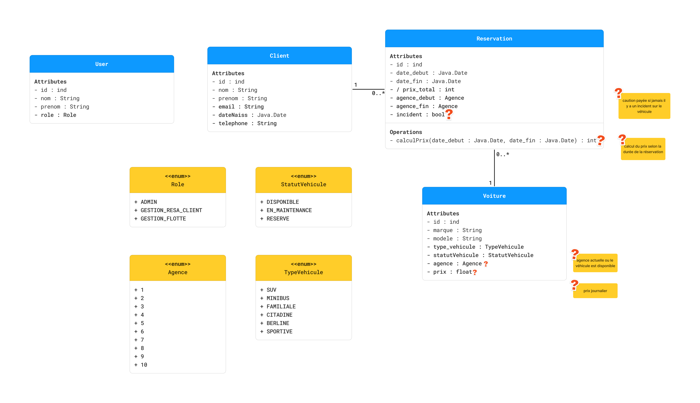

# Cahier technique

## Modèle relationnel

User (id : int(7), nom : varchar(100), prenom : varchar(100), role : enum(...))
Clé primaire : id (auto-incrémenté)
Clé étrangère : /

Client (id : int(7), nom : varchar(100), prenom : varchar(100), email : varchar(100), dateNaiss : Date, telephone : varchar(10))
Clé primaire : id (auto-incrémenté)
Clé étrangère : /

Reservation (id : int(7), idClient : int(7), idVoiture : int(7) ,dateDebut : Date, dateFin : Date, prixTotal : int, agenceDebut : enum(Agence), agenceFin : enum(Agence), incident : Boolean)
Clé primaire : id (auto-incrémenté)
Clé étrangère : 
    idClient -> Client.id
    idVoiture -> Voiture.id

Voiture (id : int(7), marque : varchar(100), modele : varchar(100), typeVehicule : enum(...), statutVehicule : enum(...), agence : enum(...), prix : float(7,2))
Clé primaire : id (auto-incrémenté)
Clé étrangère : /

### Diagramme de classe UML

