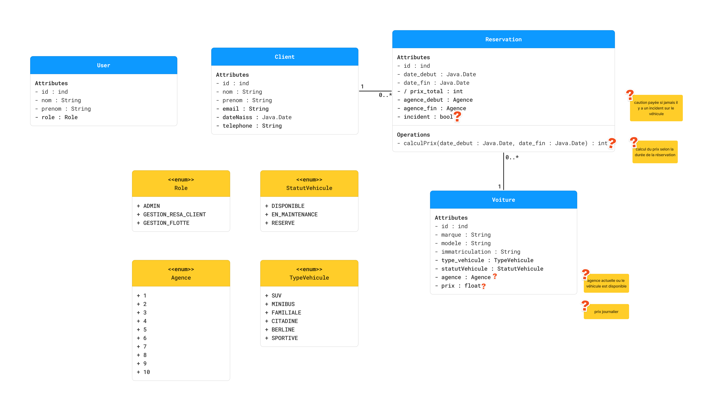

# Cahier technique

## A quoi sert le projet / pour qui ?
Le projet vise à développer une application de location de voitures en JavaFX. Les utilisateurs pourront choisir parmi
les 10 plus grandes villes de France pour la prise en charge et la restitution des véhicules.  
C'est une application métier qui s'adresse donc à une entreprise de location de voitures.

## Gantt
  

## Contraintes techniques
- JavaFX : version 11
- Base de données MySQL : version 8.0
- Jira
- Figma
- GitHub
- Discord

## Structure du projet
*packages, a quoi ils servent etc...  
(DAO, MWA, Controller, etc.)*

* **DAO**: Data Access Object, contient les classes qui permettent de faire le lien entre la base de données et l'application.
* **MWA**: Motorized Wide Area, contient les classes qui permettent de gérer les objets métiers.
* **Controller**: contient les classes qui permettent de gérer les événements de l'interface graphique.
* **View**: contient les fichiers FXML qui permettent de définir l'interface graphique.
* **Model**: contient les classes qui permettent de définir les objets métiers.
* **Utils**: contient les classes qui permettent de gérer les connexions à la base de données.
* **Test**: contient les classes qui permettent de tester les différentes fonctionnalités de l'application.
* **Resources**: contient les fichiers de ressources (images, css, etc.)
* **Main**: contient la classe principale de l'application.

## Modèle relationnel

User (id : int(7), nom : varchar(100), prenom : varchar(100), role : enum(...))  
Clé primaire : id (auto-incrémenté)  
Clé étrangère : /

Client (id : int(7), nom : varchar(100), prenom : varchar(100), email : varchar(100), dateNaiss : Date, telephone : varchar(10))  
Clé primaire : id (auto-incrémenté)  
Clé étrangère : /

Reservation (id : int(7), idClient : int(7), idVoiture : int(7) ,dateDebut : Date, dateFin : Date, prixTotal : int, agenceDebut : enum(Agence), agenceFin : enum(Agence), incident : Boolean)  
Clé primaire : id (auto-incrémenté)  
Clé étrangère : 
    idClient -> Client.id
    idVoiture -> Voiture.id

Voiture (id : int(7), marque : varchar(100), modele : varchar(100), typeVehicule : enum(...), statutVehicule : enum(...), agence : enum(...), prix : float(7,2))  
Clé primaire : id (auto-incrémenté)  
Clé étrangère : /

### Rappel du diagramme de classe UML

